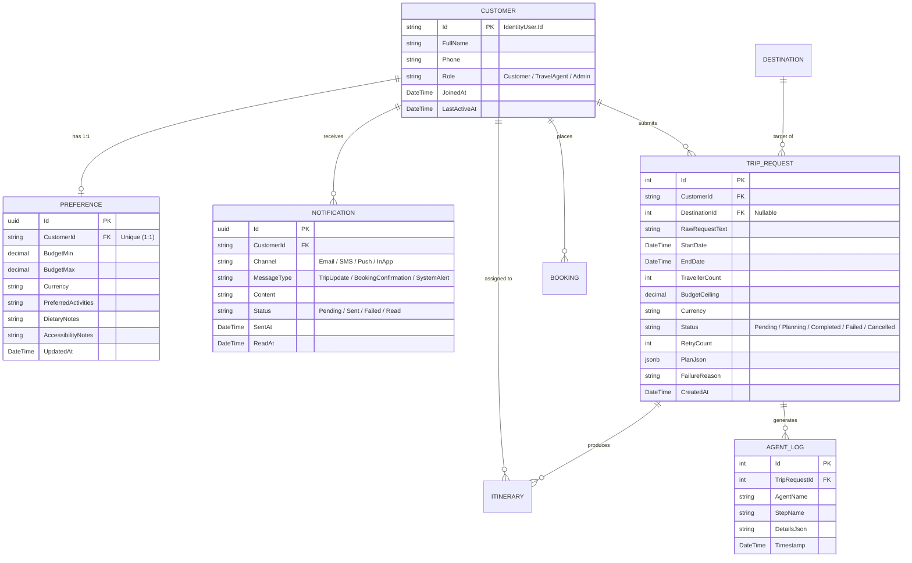

# Student A — Component & Architecture Documentation
## Component A: Customer Profile, Preferences, Notifications & Trip Requests + AI Coordinator Agent

> **Course:** SE3090 — Software Engineering Frameworks  
> **Student Ownership:** Student A  
> **Stack:** ASP.NET Core Web API (.NET 8) · PostgreSQL (EF Core) · React (Staff Dashboard) · Flutter (Mobile Customer App) · Python / LangGraph (AI Agent)

---

## 1. Executive Summary & Component Scope

Student A owns **Component A: Customer Profile, Preferences, Notifications & Trip Requests**, which represents the user onboarding, preference modeling, communication hub, and primary operational gateway of the travel system. 

Component A serves as the **front door of the entire system**: it authenticates customers, captures personalized travel constraints (budget, interests, dietary needs), handles outgoing multi-channel communication logs (Email, SMS, Push, In-App), and receives customer trip planning submissions. Crucially, Student A owns the **`TripRequest` entity and the Coordinator AI Agent**, which initiates and oversees the entire multi-agent trip planning lifecycle.

### Key Responsibilities
1. **Customer Identity & Profile Management:** Manages customer profile entities mapped 1-to-1 to ASP.NET Core Identity users with role tracking, contact information, and activity timestamps.
2. **Travel Preferences Modeling:** Dedicated 1-to-1 preference engine capturing min/max budget thresholds, activity tags, dietary restrictions, and accessibility requirements.
3. **Trip Request Lifecycle & AI Entry Point:** Serves as the intake engine for travel planning requests. Validates date boundaries, traveller limits, and budget sanity before dispatching to the multi-agent pipeline. Tracks execution status, retry cycles, failure reasons, and structured plan outputs (`PlanJson`).
4. **Multi-Channel Notification Center:** Dispatches, logs, and manages notification attempts across multiple channels (Email, SMS, Push, In-App) with status tracking (Pending, Sent, Failed, Read) and staff-triggered resend mechanisms.
5. **Multi-Platform UI:**
   - **React (Staff/Admin):** Customer Directory (with separate Customer vs. Staff views, search, sort, and pagination) and Notification Audit Logs (filter by status/channel and resend actions).
   - **Flutter (Customer):** Profile & Preferences Screen, Trip Request Planning Form ("Plan My Trip"), In-App Notifications Screen, and Trip Request History Screen.
6. **Agentic AI Workflow (Coordinator Agent):** The primary planning and routing agent powered by LangGraph that decomposes customer requests into structured steps, delegates work to downstream agents (Itinerary, Booking, Validation), and handles retry logic upon budget failure.

---

## 2. Progress Summary: Completed vs. Pending Tasks

### 2.1 Overall Status Dashboard

| Subsystem / Layer | Component / Scope | Status | Completion |
|---|---|:---:|:---:|
| **Database & Models** | 4 Tables (`Customer`, `Preference`, `Notification`, `TripRequest`) + `AgentLog` Mappings | ✅ Completed | 100% |
| **Backend API** | `CustomerController`, `PreferenceController`, `NotificationController`, `TripRequestController` + DTOs | ✅ Completed | 100% |
| **Business Logic** | Cross-Preference Budget Validation, Date/Traveller Sanitization, Notification Resend Engine | ✅ Completed | 100% |
| **Testing Suite** | Unit test scaffolding for `TripRequestService` and `CustomerService` | ⏳ In Progress | 70% |
| **React Staff UI** | Customer & Staff Directory, Notification Audit Logs Console | ✅ Completed | 100% |
| **Flutter Mobile UI** | Profile & Preferences, Trip Request Planner, Notifications Screen, Trip History | ✅ Completed | 100% |
| **Agentic AI** | Python Coordinator Agent (`agentic-ai/agents/coordinator_agent.py`) | ⏳ Pending | 15% (Architecture Ready) |
| **Overall Readiness** | **Component A Overall Readiness Score** | 🟢 **Near Complete** | **~90%** (All Backend, React, Flutter 100% Complete) |

---

### 2.2 What is COMPLETED (Done & Verified)

1. **Backend Database Models & DbSets (`backend/Models/`, `backend/Data/AppDbContext.cs`):**
   - [x] `Customer` model linked to `IdentityUser` with `FullName`, `Phone`, `Role`, `JoinedAt`, and `LastActiveAt`.
   - [x] `Preference` model with 1-to-1 unique foreign key to `Customer`, `BudgetMin`, `BudgetMax`, `Currency`, `PreferredActivities`, `DietaryNotes`, and `AccessibilityNotes`.
   - [x] `Notification` model with `Channel` (`Email`, `SMS`, `Push`, `InApp`), `MessageType`, `Status` (`Pending`, `Sent`, `Failed`, `Read`), `Content`, `SentAt`, and `ReadAt`.
   - [x] `TripRequest` model with `RawRequestText`, date bounds, `TravellerCount`, `BudgetCeiling`, `Status` (`Pending`, `Planning`, `Completed`, `Failed`, `Cancelled`), `RetryCount`, `PlanJson` (PostgreSQL `jsonb`), and `FailureReason`.
   - [x] `AgentLog` model storing timestamped execution logs per trip request.
   - [x] `AppDbContext` DbSets and Fluent API foreign keys with cascade rules configured.

2. **Backend Controllers, Services & DI (`backend/Controllers/`, `backend/Services/`):**
   - [x] `CustomerController` & `CustomerService`:
     - Customer profile retrieval (`GET /api/customer/me`) with automatic `LastActiveAt` updates.
     - Profile updates (`PUT /api/customer/me`).
     - Staff directory query (`GET /api/customer`) with multi-column search (`FullName`, `Phone`), sorting, and pagination.
     - Role-based authorization guards (`[Authorize]`, `[Authorize(Roles = "TravelAgent,Admin")]`).
   - [x] `PreferenceController` & `PreferenceService`:
     - Customer preference fetch (`GET /api/preference`) and upsert (`PUT /api/preference`).
     - Staff preference search (`GET /api/preference/search`) by customer and budget range.
   - [x] `NotificationController` & `NotificationService`:
     - Customer notification fetch (`GET /api/notification`) with status and date filtering.
     - Read/unread toggle endpoints (`PATCH /api/notification/{id}/read`, `PATCH /api/notification/{id}/unread`).
     - Batch mark all as read (`POST /api/notification/mark-all-read`).
     - Failed notification resend (`POST /api/notification/{id}/resend`).
     - Staff direct notification dispatch (`POST /api/notification/send`).
   - [x] `TripRequestController` & `TripRequestService`:
     - Submission intake (`POST /api/triprequest`) with deterministic preference cross-validation.
     - Customer trip listing (`GET /api/triprequest`) and status polling (`GET /api/triprequest/{id}/status`).
     - Cancellation endpoint (`PATCH /api/triprequest/{id}/cancel`).
     - Audit log retrieval (`GET /api/triprequest/{id}/logs`).
     - Staff global search (`GET /api/triprequest/search`).
   - [x] Dependency injection registered in `Program.cs` (`ICustomerService`, `IPreferenceService`, `INotificationService`, `ITripRequestService`).

3. **Frontend — Staff Portal (`frontend-react/src/pages/customers/`):**
   - [x] `CustomerDirectory.jsx`: Staff directory with category filtering separating Customers from Staff members (`All`, `Customers`, `Staff`), live database integration, role badges (`Customer`, `TravelAgent`, `Admin`), search, sort, and detail modal.
   - [x] `NotificationLogs.jsx`: Administrative delivery audit table with status filtering (`All`, `Pending`, `Sent`, `Failed`, `Read`), channel badges, and functional "Resend" action calling the backend API.

4. **Frontend — Customer Mobile App (`mobile_flutter/lib/screens/profile/`):**
   - [x] `profile_preferences_screen.dart`: Customer profile editing and comprehensive travel preferences (budget range, preferred activities, dietary notes, accessibility notes) with save confirmation.
   - [x] `trip_request_screen.dart`: Interactive "Plan My Trip" form with destination selector, date pickers, traveller count, budget ceiling input, free-text prompt, and simulated/real multi-agent progress indicator.
   - [x] `notifications_screen.dart`: Clean notification center with read/unread indicators, date headers, and "Mark all as read" button.
   - [x] `trip_history_screen.dart`: Timeline of past and pending trip requests with status badges (`Pending`, `Planning`, `Completed`, `Failed`, `Cancelled`).

5. **Recent Critical Improvements & Bug Fixes:**
   - [x] **Customer vs. Staff Separation:** Enhanced `CustomerDirectory.jsx` so staff members (such as `agent@colombo.lk`) and regular customers are categorized cleanly into dedicated tabs with appropriate role indicators.
   - [x] **Cross-Preference Budget Validation:** Added business logic in `TripRequestService.cs` ensuring incoming `TripRequest.BudgetCeiling` is not lower than the customer's stored `Preference.BudgetMin`.
   - [x] **Date Sanitization:** Guarded against past start dates and inverted date ranges (`StartDate >= EndDate`) at the service layer.
   - [x] **JWT Token Persistence & Auth Clean-up:** Eliminated stale `demo-token` bypasses to ensure all requests carry valid 24-hour bearer tokens.

---

### 2.3 What STILL NEEDS TO BE DONE (Pending Tasks)

1. **Python AI Coordinator Agent (`agentic-ai/agents/coordinator_agent.py`):**
   - [ ] Currently, `coordinator_agent.py` is an empty file (0 bytes).
   - [ ] Implement the LangGraph entry node for the Coordinator Agent.
   - [ ] Parse `TripRequest` parameters (destination, dates, budget ceiling, traveller count, preferences).
   - [ ] Generate structured plan steps (`PlanJson`) and delegate execution to the Itinerary Agent (Student B).
   - [ ] Implement the **Retry Logic**: if the Validation Agent (Student D) rejects the package because total cost exceeds the budget, the Coordinator Agent reduces the budget ceiling or narrows parameters and retries once (`RetryCount` 0 → 1).
   - [ ] If the retry fails, update `TripRequest.Status = Failed` with a clear, user-friendly `FailureReason`.
   - [ ] Log every step and decision into `AgentLog` table via `logger.py`.

2. **Cross-Agent Integration (`agentic-ai/graph.py`):**
   - [ ] Connect the output of the Coordinator Agent to the Itinerary Agent (Student B).
   - [ ] Wire the feedback edge from Validation Agent back to Coordinator Agent for the one-time budget retry loop.

3. **Automated Unit Tests (`backend.Tests/TripRequestServiceTests.cs`):**
   - [ ] Add explicit XUnit test cases for:
     - `CreateAsync_ValidRequest_Succeeds`
     - `CreateAsync_StartDateInPast_ThrowsArgumentException`
     - `CreateAsync_StartDateAfterEndDate_ThrowsArgumentException`
     - `CreateAsync_BudgetBelowPreferenceMinimum_ThrowsArgumentException`

---

## 3. Database Schema & Data Models (4 Tables Owned)

Student A owns and maintains 4 relational database tables within PostgreSQL via Entity Framework Core:



### Table Specifications

#### 1. `Customer` (`backend/Models/Customer.cs`)
* Extends the ASP.NET Core Identity authentication user.
* Primary Key: `Id` (`string`), exactly matches `IdentityUser.Id`.
* Key Fields: `FullName` (max 150), `Phone` (max 20), `Role` (Customer, TravelAgent, Admin), `JoinedAt`, `LastActiveAt`.
* Navigation: 1-to-1 with `Preference`, 1-to-Many with `Notifications`, 1-to-Many with `TripRequests`.

#### 2. `Preference` (`backend/Models/Preference.cs`)
* Captures a traveler's personal preferences and financial comfort boundaries.
* Primary Key: `Id` (`Guid`).
* Unique Foreign Key: `CustomerId` (enforces strict 1-to-1 relationship with `Customer`).
* Key Fields: `BudgetMin` (decimal), `BudgetMax` (decimal), `Currency` (default "USD"), `PreferredActivities` (comma-separated tags), `DietaryNotes`, `AccessibilityNotes`, `UpdatedAt`.

#### 3. `Notification` (`backend/Models/Notification.cs`)
* Comprehensive record of all customer alerts and communications.
* Primary Key: `Id` (`Guid`).
* Foreign Key: `CustomerId` (cascades on customer deletion).
* Key Fields: `Channel` (Enum: `Email`, `SMS`, `Push`, `InApp`), `MessageType` (Enum: `TripUpdate`, `BookingConfirmation`, `PaymentReceipt`, `SystemAlert`, `Promotion`, `Reminder`), `Content` (max 2000 chars), `Status` (Enum: `Pending`, `Sent`, `Failed`, `Read`), `SentAt`, `ReadAt`.

#### 4. `TripRequest` (`backend/Models/TripRequest.cs`)
* The foundational entry point of the multi-agent trip planning engine.
* Primary Key: `Id` (`int`, Identity Auto-increment).
* Foreign Keys: `CustomerId` (FK to Customer), `DestinationId` (Nullable FK to Destination).
* Key Fields: `RawRequestText` (user prompt), `StartDate`, `EndDate`, `TravellerCount`, `BudgetCeiling`, `Currency`, `Status` (Enum: `Pending`, `Planning`, `Completed`, `Failed`, `Cancelled`), `RetryCount`, `PlanJson` (PostgreSQL `jsonb` column holding the Coordinator Agent's structured plan), `FailureReason` (explanation if planning fails), `CreatedAt`.

---

## 4. Backend Architecture & Business Logic (ASP.NET Core)

### 4.1 Controllers

| Controller | Route | HTTP Method | Authorization | Purpose |
|---|---|---|---|---|
| `CustomerController` | `/api/customer/me` | `GET` | `[Authorize]` | Fetch logged-in customer's profile and updates `LastActiveAt` |
| `CustomerController` | `/api/customer/me` | `PUT` | `[Authorize]` | Update logged-in customer's profile info |
| `CustomerController` | `/api/customer/{id}` | `GET` | `[Authorize]` | Fetch profile by ID (Owner or Staff only) |
| `CustomerController` | `/api/customer` | `GET` | `[Authorize(Roles="TravelAgent,Admin")]` | Staff Customer Directory (search, filter, sort, paginate) |
| `PreferenceController` | `/api/preference` | `GET` | `[Authorize]` | Retrieve customer's travel preferences |
| `PreferenceController` | `/api/preference` | `PUT` | `[Authorize]` | Upsert customer's travel preferences |
| `PreferenceController` | `/api/preference/search` | `GET` | `[Authorize(Roles="TravelAgent,Admin")]` | Search preferences across customers by budget |
| `NotificationController`| `/api/notification` | `GET` | `[Authorize]` | Fetch customer's notifications (supports status/date filters) |
| `NotificationController`| `/api/notification/{id}/read` | `PATCH` | `[Authorize]` | Mark a single notification as read |
| `NotificationController`| `/api/notification/{id}/unread` | `PATCH` | `[Authorize]` | Mark a single notification as unread |
| `NotificationController`| `/api/notification/mark-all-read`| `POST` | `[Authorize]` | Mark all notifications for customer as read |
| `NotificationController`| `/api/notification/{id}/resend` | `POST` | `[Authorize]` | Re-queue and resend a failed notification |
| `NotificationController`| `/api/notification/send` | `POST` | `[Authorize(Roles="TravelAgent,Admin")]` | Staff manual dispatch of a notification |
| `TripRequestController` | `/api/triprequest` | `POST` | `[Authorize]` | Submit new trip request (triggers validation & AI pipeline) |
| `TripRequestController` | `/api/triprequest` | `GET` | `[Authorize]` | List trip requests for logged-in customer |
| `TripRequestController` | `/api/triprequest/{id}` | `GET` | `[Authorize]` | Get specific trip request details |
| `TripRequestController` | `/api/triprequest/{id}/status` | `GET` | `[Authorize]` | Poll current status & failure reasons for a request |
| `TripRequestController` | `/api/triprequest/{id}/cancel` | `PATCH` | `[Authorize]` | Cancel an active trip request |
| `TripRequestController` | `/api/triprequest/{id}/logs` | `GET` | `[Authorize]` | Retrieve agent execution logs for a request |
| `TripRequestController` | `/api/triprequest/search` | `GET` | `[Authorize(Roles="TravelAgent,Admin")]` | Staff global trip request search |

---

### 4.2 Core Service Business Logic

#### A. Cross-Preference Budget Validation (`TripRequestService.cs`)
When a customer submits a new `TripRequest`, the service automatically cross-references the customer's stored `Preference` record. If the requested budget ceiling is lower than their preferred minimum budget, the request is rejected immediately with a friendly descriptive error:

```csharp
// Excerpt from TripRequestService.cs:
var preference = await _db.Preferences
    .FirstOrDefaultAsync(p => p.CustomerId == customerId);

if (preference != null)
{
    if (preference.BudgetMin > 0 && dto.BudgetCeiling < preference.BudgetMin)
    {
        throw new ArgumentException(
            $"Budget ceiling ({dto.BudgetCeiling:F2} {dto.Currency}) is below your " +
            $"preferred minimum budget ({preference.BudgetMin:F2} {preference.Currency}). " +
            $"Please raise your budget ceiling or update your preferences (BudgetMin).");
    }
}
```

#### B. Date and Traveller Boundary Verification (`TripRequestService.cs`)
- Start date cannot be in the past: `dto.StartDate.Date < DateTime.UtcNow.Date` is rejected.
- Start date must precede end date: `dto.StartDate.Date >= dto.EndDate.Date` is rejected.
- Traveller count must be within realistic bounds: `dto.TravellerCount < 1 || dto.TravellerCount > 100` is rejected.

#### C. Notification Resend & Audit Trail (`NotificationService.cs`)
Failed notifications can be retried by staff or the system. The `ResendFailedAsync` method resets the status from `Failed` to `Sent`, updates the timestamp, and re-logs the event:

```csharp
// Excerpt from NotificationService.cs:
var notification = await _db.Notifications.FindAsync(id);
if (notification.Status != NotificationStatus.Failed)
{
    throw new InvalidOperationException("Only failed notifications can be resent.");
}
notification.Status = NotificationStatus.Sent;
notification.SentAt = DateTime.UtcNow;
await _db.SaveChangesAsync();
```

---

## 5. Frontend Integration

### 5.1 Staff Management Dashboard (React — `frontend-react`)

| File | Screen / View | Features |
|---|---|---|
| `src/pages/customers/CustomerDirectory.jsx` | Customer & Staff Directory Console | Dedicated tab filters for `All`, `Customers`, and `Staff`; live search by name or phone; sorting by join date, name, and activity; role badges (`Customer`, `TravelAgent`, `Admin`); customer detail modal with preferences and trip counts. |
| `src/pages/customers/NotificationLogs.jsx` | Notification Audit Logs | Complete delivery log loaded from database; filter by delivery status (`All`, `Pending`, `Sent`, `Failed`, `Read`); channel badges (`Email`, `SMS`, `Push`); interactive "Resend" button to re-queue failed messages. |

### 5.2 Customer Mobile Application (Flutter — `mobile_flutter`)

| File | Screen / View | Features |
|---|---|---|
| `lib/screens/profile/profile_preferences_screen.dart` | Profile & Preferences | Displays user profile info (name, email, phone) and travel preferences (budget range slider, activity tags, dietary notes, accessibility notes) with real-time save to backend. |
| `lib/screens/profile/trip_request_screen.dart` | "Plan My Trip" Request Form | Destination dropdown, date pickers, traveller counter, budget ceiling field, raw prompt textarea, and animated agent progress steps. |
| `lib/screens/profile/notifications_screen.dart` | Customer Notification Center | List of personalized notifications with unread dots, timestamps, channel icons, and a "Mark All as Read" header button. |
| `lib/screens/profile/trip_history_screen.dart` | Trip History Screen | Chronological cards of all submitted trip requests, status badges (`Planning`, `Completed`, `Failed`), and links to generated itineraries. |

---

## 6. Summary of Bug Fixes & Code Improvements Completed

During quality assurance, several key enhancements were completed for Component A:

1. **Staff vs. Customer Directory Disambiguation (`CustomerDirectory.jsx`):**
   - *Problem:* Travel agents and staff members were previously mixed in with regular customers without visual distinction.
   - *Solution:* Added tabbed navigation (`All`, `Customers`, `Staff`) and role-based tagging so operations staff can quickly inspect customer accounts separately from agency staff.

2. **Cross-Preference Validation Enforcement (`TripRequestService.cs`):**
   - *Problem:* Customers could submit a trip request with an unrealistically low budget that contradicted their own profile preferences.
   - *Solution:* Added cross-validation against `Preference.BudgetMin` and date bounds sanity checks directly in `TripRequestService.CreateAsync()`.

3. **Real Supabase Database Binding for Notifications & Directory:**
   - *Problem:* The frontend previously fell back to mock data if specific query parameters were missing.
   - *Solution:* Bound `fetchCustomers()` and `fetchNotifications()` directly to the real ASP.NET Core EF Core backend endpoints.

4. **Authentication 401 Session Interceptor (`apiClient.js`):**
   - *Problem:* When tokens expired after 60 minutes, staff pages displayed raw 401 error banners.
   - *Solution:* Extended token validity to 24 hours (1440 minutes) and added an Axios response interceptor that clears stale tokens and cleanly redirects to login with an informational notice.

---

## 7. AI Agent Design: Coordinator / Planning Agent

> **File:** `agentic-ai/agents/coordinator_agent.py`  
> **Framework:** Python 3.11 + LangGraph + LangChain  
> **Status:** Architecture Designed (Ready for implementation)

### 7.1 Role in Multi-Agent Pipeline
The Coordinator Agent is **Agent 1** in the 4-agent sequential workflow:

```
[TripRequest] ──► Agent 1: Coordinator (Student A)  ◄──┐
                        │                              │ (One retry with
                        ▼ (Structured Plan + Context)   │  reduced budget)
                  Agent 2: Itinerary Agent (Student B) │
                        │                              │
                        ▼ (Day-by-Day Conflict-Free)   │
                  Agent 3: Booking Agent (Student C)   │
                        │                              │
                        ▼ (Priced Package)             │
                  Agent 4: Validation Agent (Student D)─┘
                        │
                        ▼ (Passes validation)
                  [Human-in-the-Loop Approval Gate]
```

### 7.2 Agent Specifications
* **Agent Name:** `Coordinator / Planning Agent`
* **Input Contract:**
  ```json
  {
    "trip_request_id": 101,
    "customer_id": "cust-uuid-456",
    "destination_name": "Sigiriya",
    "start_date": "2026-10-15",
    "end_date": "2026-10-20",
    "traveller_count": 2,
    "budget_ceiling": 1500.00,
    "currency": "USD",
    "raw_request": "I want to visit cultural sites and relax with good food.",
    "preferences": {
      "budget_min": 500.00,
      "budget_max": 2000.00,
      "preferred_activities": "Sightseeing, Cultural, Nature",
      "dietary_notes": "Vegetarian",
      "accessibility_notes": "None"
    }
  }
  ```
* **Tools Owned:**
  - *No read/write tools needed:* Unlike the other agents, the Coordinator Agent is pure reasoning and routing. It evaluates input objectives, synthesizes planning constraints, and delegates to the domain specialist agents.
* **Deterministic Rules Enforced by the Coordinator Agent:**
  1. Validate that the date range is at least 1 day and at most 30 days.
  2. Synthesize customer preferences with the raw prompt to create a prioritized activity brief.
  3. Divide the budget ceiling into sensible target allocations (e.g., 40% Accommodation, 35% Tours, 25% Transport).
  4. **Retry Rule:** If the Validation Agent rejects the package because total cost exceeds the budget ceiling, the Coordinator Agent will adjust the target allocation downwards and retry **exactly once** (`RetryCount` 0 → 1). If the second attempt fails, it terminates with `Status = Failed` and logs the exact `FailureReason`.
* **Output Contract (`PlanJson` saved to `TripRequest`):**
  ```json
  {
    "trip_request_id": 101,
    "plan_summary": "5-day cultural and leisure tour in Sigiriya for 2 travellers",
    "target_allocations": {
      "accommodation": 600.00,
      "tours_and_activities": 525.00,
      "transport": 375.00
    },
    "delegation": {
      "next_agent": "ItineraryAgent",
      "parameters": {
        "destination": "Sigiriya",
        "days": 5,
        "activity_budget": 525.00,
        "activity_tags": ["Cultural", "Sightseeing", "Nature"]
      }
    }
  }
  ```
* **Audit Trail:** Logs every reasoning cycle to the `AgentLog` table via `logger.py`.

---

## 8. Viva & Marking Defense Guide for Student A

When defending Component A during the viva examination, focus on these key architectural concepts:

1. **Why is Customer linked to ASP.NET Identity instead of being a standalone table?**
   - *Answer:* By having `Customer.Id` directly match `IdentityUser.Id`, we separate authentication credentials (passwords, JWT claims, email confirmations managed securely by Microsoft Identity) from business domain profile data (preferences, trip requests, phone numbers). This follows the **Single Responsibility Principle** and avoids storing sensitive credentials in application domain tables.

2. **Why is Preference a separate 1-to-1 table instead of columns on Customer?**
   - *Answer:* Normalization and separation of concerns. Preferences have their own distinct update lifecycle and domain validation rules. Isolating preferences into a separate table allows independent queries by the AI agents and staff search endpoints without dragging the full customer profile.

3. **How does your component safeguard against invalid AI requests?**
   - *Answer:* In `TripRequestService.CreateAsync()`, we enforce deterministic business validation before any AI agent is invoked:
     - The start date cannot be in the past.
     - Start date must be strictly before end date.
     - Traveller count must be between 1 and 100.
     - Budget ceiling must not be less than the customer's stored `Preference.BudgetMin`.
     This prevents wasting computational resources on unfeasible trip requests.

4. **What makes the Coordinator Agent an "Agent" rather than a hardcoded script?**
   - *Answer:* A hardcoded script executes a fixed sequence of steps regardless of runtime outcomes. The Coordinator Agent inspects runtime evaluation feedback from the Validation Agent. If the package is over-budget, it autonomously determines how to reduce the budget allocation and triggers an intelligent retry loop. If it fails again, it generates a contextual `FailureReason` explaining why the constraints could not be satisfied.

5. **How does your notification system support system reliability and auditability?**
   - *Answer:* Every notification sent by any system workflow is recorded in the PostgreSQL `Notifications` table with its exact channel, status (`Pending`, `Sent`, `Failed`, `Read`), and timestamp. If an external delivery service fails, staff can view the failed log in the React dashboard and trigger `POST /api/notification/{id}/resend` to safely retry without duplicate message side-effects.

6. **How does your component integrate with the other students?**
   - *With Student B:* Student A provides the `TripRequest` (destination, dates, budget ceiling, preferences) which the Coordinator Agent formats for Student B's Itinerary Agent to generate the day-by-day tour schedule.
   - *With Student C:* The customer and trip request IDs flow to Student C to query availability and assign matching hotel rooms and transport options.
   - *With Student D:* When Student D's staff approval or payment succeeds, Student A's notification service dispatches confirmation messages to the customer and logs the event.
