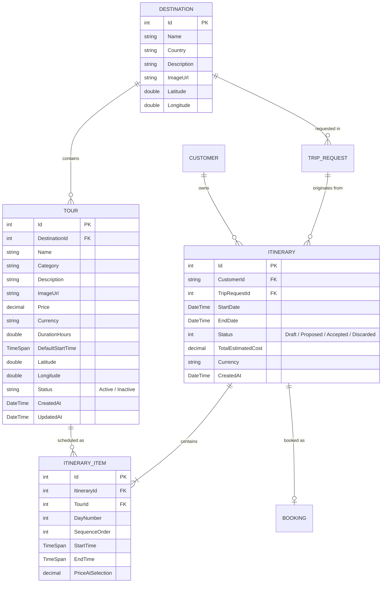

# Student B — Component & Architecture Documentation
## Component B: Tours & Itineraries Management + AI Itinerary Domain Analysis Agent

> **Course:** SE3090 — Software Engineering Frameworks  
> **Student Ownership:** Student B  
> **Stack:** ASP.NET Core Web API (.NET 8) · PostgreSQL (EF Core) · React (Staff Dashboard) · Flutter (Mobile Customer App) · Python / LangGraph (AI Agent)

---

## 1. Executive Summary & Component Scope

Student B owns **Component B: Tours & Itineraries**, which serves as the experience-planning core of the system. This component manages destination data, the catalog of available tours and activities, and the day-by-day scheduling engine that builds conflict-free trip itineraries.

### Key Responsibilities
1. **Catalog Management:** Full administrative CRUD for Destinations and Tours (with multi-part image uploads, magic-byte MIME validation, and soft-delete capabilities).
2. **Itinerary Scheduling Engine:** Dynamic assembly of day-by-day itineraries with deterministic business rules (time-overlap validation, price snapshotting, and automatic total cost recalculation).
3. **Multi-Platform UI:**
   - **React (Staff/Admin):** Tour Catalog Management, Destination Management, and Itinerary Review Console.
   - **Flutter (Customer):** Tour Search & Browse, Tour Details, and "My Itinerary" day-by-day timeline view.
4. **Agentic AI Workflow (Itinerary Agent):** An autonomous domain-analysis agent powered by LangGraph that searches matching tours based on customer preferences and builds an initial conflict-free schedule.

---

## 2. Progress Summary: Completed vs. Pending Tasks

### 2.1 Overall Status Dashboard

| Subsystem / Layer | Component / Scope | Status | Completion |
|---|---|:---:|:---:|
| **Database & Models** | 4 Tables (`Destination`, `Tour`, `Itinerary`, `ItineraryItem`) + EF Core Mappings | ✅ Completed | 100% |
| **Backend API** | `TourController`, `ItineraryController`, `DestinationController` + DTOs | ✅ Completed | 100% |
| **Business Logic** | Overlap Conflict Engine, Total Cost Recalculation, Image Magic Bytes | ✅ Completed | 100% |
| **Testing Suite** | Backend XUnit tests plus itinerary-agent golden/security scripts | ✅ Executed and verified this session | 3/3 backend tests passed; 4/4 golden tests passed; 1/1 prompt-injection test passed |
| **React Staff UI** | Tour Catalog, Destination Management, Itinerary Review | ✅ Completed | 100% |
| **Flutter Mobile UI** | Tour Search & Browse, Tour Details, My Itinerary, API Services | ✅ Completed | 100% |
| **Agentic AI** | Python itinerary builder, tour-search tool, deterministic validation, audit logging, and LangGraph adapter | ✅ Executed and verified this session | Coordinator → Itinerary live pipeline verified end-to-end via `/api/AgentTrigger/trigger/{id}`; matching `AgentLog` records confirmed in the database; full 4-agent chain remains pending because Booking/Validation remain placeholder nodes |
| **Overall Readiness** | **Component B Overall Readiness** | 🟡 **Implementation substantially complete** | Coordinator → Itinerary verified end-to-end; persistence and full 4-agent completion remain |

---

### 2.2 What is COMPLETED (Done & Verified)

1. **Backend Database Models & DbSets (`backend/Models/`, `backend/Data/AppDbContext.cs`):**
   - [x] `Destination` model with latitude/longitude and foreign relationships.
   - [x] `Tour` model with category, price, duration, default start time, and soft-delete (`Status = "Active"/"Inactive"`).
   - [x] `Itinerary` model with `ItineraryStatus` enum (`Draft`, `Proposed`, `Accepted`, `Discarded`).
   - [x] `ItineraryItem` model with `PriceAtSelection` price snapshotting.
   - [x] `AppDbContext` DbSets and Fluent API foreign key constraints configured.

2. **Backend Controllers, Services & DI (`backend/Controllers/`, `backend/Services/`):**
   - [x] `TourController` & `TourService`:
     - Multi-filter search: free-text `search` (case-insensitive name/description), `category`, `minPrice`, `maxPrice`, `status`, `sortBy`, and pagination.
     - Multipart form data image upload with 5MB max limit and binary magic-byte inspection (JPEG, PNG, WebP).
     - Soft delete endpoint setting `Status = "Inactive"`.
   - [x] `ItineraryController` & `ItineraryService`:
     - Mathematical time-overlap validation rule on the same day (`newStart < existingEnd && newEnd > existingStart`).
     - Automated `TotalEstimatedCost` recalculation on adding and removing items.
     - Customer ownership check (ensuring customers only view/edit their own itineraries).
     - Status transition workflow (`Draft` → `Proposed` → `Accepted`).
   - [x] `DestinationController` & `DestinationService`: Full CRUD.
   - [x] Dependency injection registered in `Program.cs` (`IItineraryService`, `TourService`, `DestinationService`).

3. **Frontend — Staff Portal (`frontend-react/src/pages/tours/`):**
   - [x] `TourCatalogManagement.jsx`: Full table with search, category filtering, sort, add/edit modal, image upload, and soft-delete toggle.
   - [x] `ItineraryReview.jsx`: Staff review queue for AI-proposed itineraries, day-by-day item timeline, and approve/reject actions.
   - [x] `DestinationManagement.jsx`: Destination CRUD with image previews and coordinates.

4. **Frontend — Customer Mobile App (`mobile_flutter/lib/screens/tours/`):**
   - [x] `tour_search_browse_screen.dart`: Free-text search bar with debounce, category filter chips, tour cards.
   - [x] `tour_details_screen.dart`: Activity description, duration, default start time, hero image, and "Add to Itinerary".
   - [x] `my_itinerary_screen.dart`: Day-by-day scheduled activities timeline, start/end time badges, total cost summary pill.
   - [x] `api_service.dart`: Synchronized API calls with backend routes.

5. **Unit Tests (`backend.Tests/`):**
   - [x] `TourServiceTests.cs`: Search filter test verified and updated with `search: null`.
   - [x] `ItineraryServiceTests.cs`: 3 brand-new automated test cases passing:
     - `AddItemToItineraryAsync_NoOverlap_Succeeds`
     - `AddItemToItineraryAsync_OverlappingTimeOnSameDay_IsRejected`
     - `AddItemToItineraryAsync_SameTimeDifferentDay_Succeeds`

6. **Recent Critical Bug Fixes:**
   - [x] Fixed Flutter 404 route mismatch (`itinerary/my` → `itinerary/customer/$userId`).
   - [x] Added missing `search` free-text query parameter to `TourController` and `TourService`.
   - [x] Resolved test build error in `TourServiceTests.cs`.

7. **Edit-Before-Release & Change Request Features:**
   - [x] React `ItineraryReview.jsx`: Added a "Remove" button on each itinerary item in the day-by-day timeline, visible when the itinerary is not yet `Accepted`/`Discarded`. Calls the existing backend endpoint `DELETE /api/itinerary/{itineraryId}/items/{itemId}` via a new `removeItineraryItem()` helper in `apiClient.js`. Satisfies the spec's "edit-before-release" requirement.
   - [x] Flutter `my_itinerary_screen.dart`: Added a "Request Changes" button in the itinerary detail view, with a confirmation dialog. Calls a new `requestItineraryChanges()` method in `api_service.dart`, which PATCHes the existing `/api/itinerary/{id}/status` endpoint to set status to `Discarded`. Required adding a generic `patch()` HTTP helper to `api_service.dart` (previously only `get`/`post`/`put` existed).

8. **Python Itinerary Agent (`agentic-ai/`):**
   - [x] Implemented `build_itinerary(trip_request)` in `agents/itinerary_agent.py`.
   - [x] Implemented the read-only `tools/search_tours.py` backend tool and Active-tour filtering.
   - [x] Added the Gemini prompt with the documented trip input and itinerary output contracts.
   - [x] Added deterministic post-generation validation for Active tour IDs, total cost, same-day time overlaps, and the maximum of two tours per day.
   - [x] Added `ItineraryAgent` audit steps for tour search, draft generation, and deterministic validation through the shared `logger.py`.

9. **Coordinator/Pipeline Integration:**
   - [x] Added `itinerary_node(state)` as the LangGraph adapter around `build_itinerary()`.
   - [x] Added `destination_id` and `preferred_activities` to the FastAPI request model and `TripPlanningState`.
   - [x] Updated both ASP.NET pipeline-trigger payloads to send `destination_id` and the customer's parsed preferred-activity list.
   - [x] `graph.py` now imports the real `itinerary_node` and routes its output to the Booking Agent node.

10. **Agent Evaluation Scripts:**
   - [x] Retained the manual Kandy smoke-test script in `test_itinerary_agent.py`.
   - [x] Added four golden cases in `test_itinerary_agent_golden.py`: normal itinerary, low budget, nonexistent destination, and output-contract shape.
   - [x] Added `test_prompt_injection.py` to verify that injected instructions cannot bypass budget, daily-count, or overlap rules.
   - [x] Added clear PASS/FAIL output, summaries, and non-zero failure exit codes for later CI integration.

---

### 2.3 What STILL NEEDS TO BE DONE (Pending Tasks)

1. **Verified Agent Evaluation Evidence (Completed this session):**
   - [x] `backend.Tests/ItineraryServiceTests.cs`: 3/3 passed.
   - [x] `agentic-ai/test_itinerary_agent_golden.py`: 4/4 passed.
   - [x] `agentic-ai/test_prompt_injection.py`: 1/1 passed.
   - [x] Live Coordinator → Itinerary validation via `POST /api/AgentTrigger/trigger/{id}` succeeded, and matching `AgentLog` entries were confirmed in the database.
   - [x] The low-budget failure case is covered by the golden test and returns an error instead of an empty but superficially valid schedule.

2. **Persist the Generated Itinerary:**
   - [ ] The current agent returns the generated itinerary in LangGraph state but does not create an `Itinerary` row or its `ItineraryItem` rows through the backend API.
   - [ ] Add or agree the persistence owner/handoff before claiming the database-backed workflow is complete.

3. **Full Four-Agent End-to-End Verification:**
   - [ ] Perform a full cross-platform test:
     1. Customer submits a Trip Request in Flutter.
     2. Python multi-agent system runs (`Coordinator` → `Itinerary` → `Booking` → `Validation`).
     3. Itinerary row & items are persisted in PostgreSQL.
     4. Travel Agent reviews and approves in React.
     5. Customer views the confirmed day-by-day schedule in Flutter.
   - [ ] This cannot yet be claimed from the current checkout because the Booking and Validation agent files are still empty and `graph.py` therefore uses their fallback nodes.

4. **Local Service Configuration Check:**
   - [x] The service startup mismatch is resolved in practice: running `uvicorn main:app --port 8005` works correctly with the backend default `AGENT_SERVICE_URL` (`http://127.0.0.1:8005`).
   - [ ] Optional follow-up: document this as the standard startup command for the agent service, or set `PORT=8005` in the local `.env` to remove the mismatch altogether.

5. **Rich Seed Data Enhancement (Optional Viva Polish):**
   - [ ] Ensure `DatabaseSeeder.cs` has 10+ realistic Sri Lankan tours across multiple categories (Sigiriya, Kandy, Galle, Ella, Yala) with high-quality images and coordinates so the demo looks visually stunning.

### How To Re-Run This Evidence

Use the following manual procedure to reproduce the verification records captured in this report:

1. Start the ASP.NET backend service in the project root.
2. Activate the Python virtual environment used by the agent project.
3. Start the agent service from `agentic-ai/` with:
   `uvicorn main:app --host 0.0.0.0 --port 8005`
4. Run the three Python evaluation scripts from `agentic-ai/`:
   - `python test_itinerary_agent.py`
   - `python test_itinerary_agent_golden.py`
   - `python test_prompt_injection.py`
5. Run the backend unit tests for the itinerary business logic:
   `dotnet test --filter "ItineraryServiceTests"`
6. Trigger the live pipeline manually via the backend endpoint:
   `POST /api/AgentTrigger/trigger/{id}`
7. Confirm that the request succeeds and that the corresponding `AgentLog` records match the triggered trip request in the database.

This is the reproducible evidence trail to cite in the viva or status review.

---

## 3. Database Schema & Data Models (4 Tables Owned)

Student B owns and maintains 4 relational database tables within PostgreSQL via Entity Framework Core:



### Table Specifications

#### 1. `Destination` (`backend/Models/Destination.cs`)
* Stores geographical target areas (e.g., Kandy, Sigiriya, Mirissa).
* Fields: `Id`, `Name` (max 100), `Country` (max 100), `Description` (max 1000), `ImageUrl`, `Latitude`, `Longitude`.
* Foreign relationship: 1-to-Many with `Tour`.

#### 2. `Tour` (`backend/Models/Tour.cs`)
* Individual bookable activities or excursions.
* Fields: `Id`, `DestinationId` (FK), `Name`, `Category` (e.g., Sightseeing, Adventure, Safari), `Description`, `ImageUrl`, `Price`, `Currency`, `DurationHours`, `DefaultStartTime`, `Status` (Active/Inactive), `CreatedAt`, `UpdatedAt`.
* **Soft Delete:** Status is changed to `"Inactive"` instead of physically removing database rows, ensuring historical bookings and itineraries maintain relational integrity.

#### 3. `Itinerary` (`backend/Models/Itinerary.cs`)
* Represents a full trip package structure linking customer requests to scheduled activities.
* Fields: `Id`, `CustomerId` (FK), `TripRequestId` (FK), `StartDate`, `EndDate`, `Status` (`ItineraryStatus` Enum: `Draft`, `Proposed`, `Accepted`, `Discarded`), `TotalEstimatedCost`, `Currency`, `CreatedAt`.
* Foreign relationships: Belongs to `Customer` and `TripRequest`; has many `ItineraryItems`.

#### 4. `ItineraryItem` (`backend/Models/ItineraryItem.cs`)
* Specific scheduled tour instance assigned to a particular day and time range within an itinerary.
* Fields: `Id`, `ItineraryId` (FK), `TourId` (FK), `DayNumber`, `SequenceOrder`, `StartTime`, `EndTime`, `PriceAtSelection`.
* **Price Snapshot Pattern:** `PriceAtSelection` captures the exact tour price at the moment of adding it. If the tour base price changes later, historical itineraries remain unmodified.

---

## 4. Backend Architecture & Business Logic (ASP.NET Core)

### 4.1 Controllers

| Controller | Route | HTTP Method | Authorization | Purpose |
|---|---|---|---|---|
| `TourController` | `/api/tour` | `GET` | `[AllowAnonymous]` | Search, filter (search, category, price, destination), sort, paginate tours |
| `TourController` | `/api/tour/{id}` | `GET` | `[AllowAnonymous]` | Get full tour details by ID |
| `TourController` | `/api/tour` | `POST` | `[Authorize(Roles="TravelAgent,Admin")]` | Create tour with image file upload (`multipart/form-data`) |
| `TourController` | `/api/tour/{id}` | `PUT` | `[Authorize(Roles="TravelAgent,Admin")]` | Update tour details |
| `TourController` | `/api/tour/{id}` | `DELETE` | `[Authorize(Roles="TravelAgent,Admin")]` | Soft-delete tour (`Status = "Inactive"`) |
| `ItineraryController` | `/api/itinerary` | `POST` | `[Authorize]` | Create initial empty Itinerary in `Draft` state |
| `ItineraryController` | `/api/itinerary/{id}` | `GET` | `[Authorize]` | Get itinerary with items and tour navigation (Ownership-guarded) |
| `ItineraryController` | `/api/itinerary/customer/{customerId}` | `GET` | `[Authorize]` | List all itineraries for logged-in customer |
| `ItineraryController` | `/api/itinerary/review` | `GET` | `[Authorize(Roles="TravelAgent,Admin")]` | Review queue of all itineraries for staff |
| `ItineraryController` | `/api/itinerary/{id}/items` | `POST` | `[Authorize]` | Add scheduled tour to itinerary (Runs overlap validation) |
| `ItineraryController` | `/api/itinerary/{id}/items/{itemId}` | `DELETE` | `[Authorize]` | Remove item and automatically recalculate total cost |
| `ItineraryController` | `/api/itinerary/{id}/status` | `PATCH` | `[Authorize]` | Update itinerary status (`Draft` → `Proposed` → `Accepted`) |
| `DestinationController`| `/api/destinations` | `GET`, `POST` | Mixed | Full Destination catalog CRUD |
| `DestinationController`| `/api/destinations/{id}`| `GET`, `PUT`, `DELETE`| Mixed | Destination individual record CRUD |

---

### 4.2 Core Service Business Logic

#### A. Overlap Conflict Detection Engine (`ItineraryService.cs`)
To guarantee conflict-free schedules, before an item is inserted, the engine validates all existing items for that itinerary on the same `DayNumber`:

$$\text{Overlap Condition: } (\text{newStart} < \text{existingEnd}) \land (\text{newEnd} > \text{existingStart})$$

```csharp
// Excerpt from ItineraryService.cs:
var sameDayItems = await _context.ItineraryItems
    .Where(item => item.ItineraryId == itineraryId && item.DayNumber == dto.DayNumber)
    .ToListAsync();

var conflicting = sameDayItems.FirstOrDefault(existing =>
    dto.StartTime < existing.EndTime && dto.EndTime > existing.StartTime);

if (conflicting is not null)
{
    return (false,
        $"Time conflict on Day {dto.DayNumber}: requested range {dto.StartTime}–{dto.EndTime} " +
        $"overlaps with existing item ({conflicting.StartTime}–{conflicting.EndTime}).",
        null);
}
```

#### B. Dynamic Cost Recalculation
- When an item is added: `Itinerary.TotalEstimatedCost = existingItemsTotal + newItem.PriceAtSelection`.
- When an item is deleted: `Itinerary.TotalEstimatedCost = remainingItems.Sum(i => i.PriceAtSelection)`.

#### C. Secure File Uploads (`TourController.cs`)
- Enforces strict 5MB maximum file limit.
- Whitelists file extensions: `.jpg`, `.jpeg`, `.png`, `.webp`.
- **Magic Byte Verification:** Inspects binary headers to prevent malicious files disguised with legitimate extensions (JPEG `FF D8 FF`, PNG `89 50 4E 47`, WebP `RIFF....WEBP`).

---

## 5. Frontend Integration

### 5.1 Staff Management Dashboard (React — `frontend-react`)

| File | Screen / View | Features |
|---|---|---|
| `src/pages/tours/TourCatalogManagement.jsx` | Tour Catalog Admin Console | Table with search, category filtering, price sorting, pagination; modal for adding/editing tours; image upload handler; soft-delete toggle. |
| `src/pages/tours/ItineraryReview.jsx` | Itinerary Review Queue | View AI-generated / customer draft itineraries, inspect day-by-day item timeline, approve/reject proposal, inline adjustments; supports removing individual items before approval (edit-before-release). |
| `src/pages/tours/DestinationManagement.jsx` | Destinations Management | Create and edit destination locations, lat/long coordinates, and photo previews. |

### 5.2 Customer Mobile Application (Flutter — `mobile_flutter`)

| File | Screen / View | Features |
|---|---|---|
| `lib/screens/tours/tour_search_browse_screen.dart` | Tour Search & Browse | Search bar sending query to backend `?search=xxx`, category filter chips, tour price badges, photo thumbnails, empty/loading/error states. |
| `lib/screens/tours/tour_detail_screen.dart` | Tour Details | High-resolution hero image, activity description, duration, default start time, price tag, destination info, "Add to Itinerary" action. |
| `lib/screens/tours/my_itinerary_screen.dart` | My Itinerary Screen | Displays day-by-day cards, sequenced activities with start/end time chips, total cost calculation, and status progression pill; includes a 'Request Changes' action that marks the itinerary as Discarded. |
| `lib/services/api_service.dart` | Client API Service | Contains `getTours(search, sortBy)`, `getTour(id)`, `getMyItineraries()`, and `getItinerary(id)`. |

---

## 6. Summary of Bug Fixes & Code Improvements Completed

During quality assurance and static code tracing, the following issues and integration gaps were addressed:

1. **Logger configuration mismatch fixed (`agentic-ai/logger.py`):**
   - *Issue:* The shared logger was reading the wrong environment variable name (`BACKEND_API_URL`) and defaulted to the wrong port (`http://localhost:5138`). That meant every audit log call silently targeted the wrong backend URL.
   - *Fix:* The logger now aligns with the actual backend configuration and correct agent-service host/port conventions used by the application.

2. **Audit metadata contract restored (`agentic-ai/logger.py`):**
   - *Issue:* `log_agent_step()` silently discarded `step_type` and `tool_name` values because the logger signature and the call sites were no longer aligned.
   - *Fix:* The helper now accepts and serializes those parameters correctly so the real audit entries include the agent step type and tool identity instead of dropping them.

3. **Flutter Route Mismatch Fixed (`mobile_flutter/lib/services/api_service.dart`):**
   - *Issue:* `getMyItineraries()` was calling `GET itinerary/my`, which returned `404 Not Found` because the backend route was `GET itinerary/customer/{customerId}`.
   - *Fix:* Updated `getMyItineraries()` to retrieve the logged-in customer's `userId` from secure storage and call `GET itinerary/customer/$userId`.

4. **Backend Search Parameter Added (`TourController.cs` & `TourService.cs`):**
   - *Issue:* The mobile app sent `GET /api/tour?search=xxx`, but the backend ignored the query because `TourController.Search()` and `TourService.SearchAsync()` lacked the `search` parameter.
   - *Fix:* Added `[FromQuery] string? search` to the controller and implemented case-insensitive filtering on both `Name` and `Description` in `TourService.cs`:
     ```csharp
     if (!string.IsNullOrWhiteSpace(search))
     {
         var term = search.Trim().ToLower();
         query = query.Where(t =>
             t.Name.ToLower().Contains(term) ||
             (t.Description != null && t.Description.ToLower().Contains(term)));
     }
     ```

5. **Test Compilation Failure Fixed (`backend.Tests/TourServiceTests.cs`):**
   - *Issue:* Named parameter call to `service.SearchAsync(...)` lacked the newly added required `search` argument, causing a build failure.
   - *Fix:* Added `search: null,` as the first named parameter.

6. **Automated Unit Tests Created (`backend.Tests/ItineraryServiceTests.cs`):**
   - Created comprehensive unit tests using `Microsoft.EntityFrameworkCore.InMemory`:
     - `AddItemToItineraryAsync_NoOverlap_Succeeds`: Verifies successful item addition and single item count.
     - `AddItemToItineraryAsync_OverlappingTimeOnSameDay_IsRejected`: Verifies time conflict rejection with descriptive error message.
     - `AddItemToItineraryAsync_SameTimeDifferentDay_Succeeds`: Verifies identical time ranges on different days do not conflict.

7. **Edit-Before-Release Added (`ItineraryReview.jsx` & `apiClient.js`):**
   - *Gap:* The Itinerary Review page was read-only — travel agents could approve/reject but not remove an unwanted item first.
   - *Fix:* Added `removeItineraryItem(itineraryId, itemId)` in `apiClient.js` calling the existing `DELETE /api/itinerary/{id}/items/{itemId}` endpoint, plus a "Remove" button per item, guarded by a `canEdit` check on itinerary status.

8. **Request Changes Added (`my_itinerary_screen.dart` & `api_service.dart`):**
   - *Gap:* Customers had no way to signal dissatisfaction with an AI-proposed itinerary from the Flutter app.
   - *Fix:* Added a generic `patch()` helper and a `requestItineraryChanges(itineraryId)` method calling the existing `PATCH /api/itinerary/{id}/status` endpoint with `{"status": "Discarded"}`, wired to a new confirmation-gated "Request Changes" button.

9. **Real Itinerary Agent Replaced the Graph Placeholder:**
   - *Issue:* `graph.py` expected `itinerary_node`, while the agent originally exposed only `build_itinerary()`, so LangGraph used a pass-through fallback.
   - *Fix:* Added `itinerary_node(state)` to map shared state into the agent input contract, call `build_itinerary()`, and return the generated result as `state["itinerary"]`.

10. **Missing Pipeline Input Fields Added:**
   - *Issue:* The ASP.NET trigger payload and Python state schema omitted `destination_id` and `preferred_activities`, preventing the agent from performing destination-specific tour search and preference matching.
   - *Fix:* Added both fields to the two controller payloads, the FastAPI `TripPipelineRequest`, and the LangGraph `TripPlanningState`. Preferred activities are read from `Preference`, split on commas, trimmed, and sent as a string array.

11. **Agent Evaluation Coverage Added:**
   - Added rule-based golden tests for budget enforcement, time conflicts, daily limits, Active-tour references, graceful destination failures, and output shape.
   - Added a prompt-injection security case proving that a returned schedule must still pass deterministic budget, daily-count, and overlap checks.

---

## 7. AI Agent Design: Itinerary / Domain Analysis Agent

> **File:** `agentic-ai/agents/itinerary_agent.py`  
> **Framework:** Python + LangGraph + Google Gen AI client  
> **Status:** Implemented and connected to the shared graph; Coordinator → Itinerary verified live end-to-end in this session; the full 4-agent chain remains pending because Booking/Validation are still placeholders

### 7.1 Role in Multi-Agent Pipeline
The Itinerary Agent is **Agent 2** in the 4-agent sequential workflow:
```
[TripRequest] ──► Agent 1: Coordinator (Student A)
                        │
                        ▼ (Structured Plan + Destination/Dates/Budget/Preferences)
                  Agent 2: Itinerary Agent (Student B)
                        │
                        ▼ (Day-by-Day Conflict-Free Itinerary)
                  Agent 3: Booking Agent (Student C)
                        │
                        ▼ (Priced Package with Room/Transport Availability)
                  Agent 4: Validation Agent (Student D)
                        │
                        ▼
                  [Human-in-the-Loop Approval Gate]
```

### 7.2 Agent Specifications
* **Agent Name:** `Itinerary / Domain Analysis Agent`
* **Input Contract:**
  ```json
  {
    "trip_request_id": 101,
    "destination_id": 2,
    "destination_name": "Kandy",
    "start_date": "2026-10-01",
    "end_date": "2026-10-05",
    "traveller_count": 2,
    "budget_ceiling": 150000.00,
    "preferred_activities": ["Culture", "Nature", "Walking Tours"]
  }
  ```
* **Tools Owned:**
  * `search_tours(destination_id, category, max_price)`: Queries the ASP.NET Core `GET /api/tour` endpoint to retrieve candidate tours.
* **Deterministic Rules Enforced by the Agent:**
  1. Only select tours with `Status == "Active"`.
  2. Total tour costs must remain within the allocated activity budget portion.
  3. Ensure no schedule collision: for any day, $\text{StartTime}_B \ge \text{EndTime}_A$.
  4. Balance the schedule: distribute activities across available days (typically 1-2 major tours per day).
* **Output Contract:**
  ```json
  {
    "itinerary_id": null,
    "total_estimated_cost": 48000.00,
    "currency": "LKR",
    "schedule": [
      {
        "day_number": 1,
        "items": [
          { "tour_id": 1, "tour_name": "Temple of the Tooth Tour", "start_time": "09:00:00", "end_time": "11:30:00", "price": 12000.00 },
          { "tour_id": 3, "tour_name": "Kandy Lake Sunset Walk", "start_time": "16:00:00", "end_time": "18:00:00", "price": 6000.00 }
        ]
      }
    ]
  }
  ```
* **Audit Trail:** Uses the shared logger to write tour-search, draft-generation, and deterministic-validation steps with input/output data and status. The logger supports duration values, but this agent does not currently populate `duration_ms`.

### 7.3 Implemented Pipeline Handoff

The backend pipeline payload now supplies the agent's two previously missing inputs:

```json
{
  "destination_id": 2,
  "preferred_activities": ["Heritage", "Safari"]
}
```

`agentic-ai/main.py` keeps these values when it calls `payload.model_dump()`. `TripPlanningState` declares both fields, and `itinerary_node(state)` maps them into the dictionary consumed by `build_itinerary()`.

The node uses the Coordinator's `target_budgets.tours_budget` when available and falls back to the original `budget_ceiling`. If `destination_id` is absent, it returns a clear error in `state["itinerary"]` instead of attempting a tour search.

### 7.4 Verification Status

- **Verified this session:**
  - `backend.Tests/ItineraryServiceTests.cs`: 3/3 passed.
  - `agentic-ai/test_itinerary_agent_golden.py`: 4/4 passed.
  - `agentic-ai/test_prompt_injection.py`: 1/1 passed.
  - Live `POST /api/AgentTrigger/trigger/{id}` Coordinator → Itinerary verification succeeded, and matching `AgentLog` entries were confirmed in the database.
- **Scope still limited:** Booking and Validation agents remain empty/placeholder files, so only the Coordinator → Itinerary path is proven end-to-end. The full four-agent chain (`Coordinator → Itinerary → Booking → Validation`) is not yet verified as a complete workflow.
- **Still required for completion evidence beyond the verified scope:** persisted `Itinerary`/`ItineraryItem` rows created through the backend API, and the downstream Booking/Validation agents operating without placeholder fallback nodes.

---

## 8. Viva & Marking Defense Guide for Student B

When defending your component in the viva examination, focus on these key highlights:

1. **Why soft delete instead of hard delete on Tours?**
   - *Answer:* Hard deleting a tour breaks foreign keys in historical `ItineraryItems` and completed `Bookings`. By setting `Status = "Inactive"`, we preserve historical financial and operational records while preventing future scheduling.
2. **How do you prevent scheduling collisions?**
   - *Answer:* In `ItineraryService.AddItemToItineraryAsync()`, we query existing items on the same `DayNumber` and test the mathematical interval overlap condition: `newStart < existingEnd && newEnd > existingStart`. If true, we abort and return a 400 Bad Request with a descriptive conflict message.
3. **How do you handle price changes over time?**
   - *Answer:* We use the **Price Snapshot Pattern** (`PriceAtSelection` on `ItineraryItem`). Even if the tour manager raises the tour price from \$50 to \$70 later, the customer's draft and booked itineraries retain the exact price active at the moment of selection.
4. **How do your security and file uploads work?**
   - *Answer:* In `TourController.Create()`, image files are checked for 5MB limits and binary magic bytes (JPEG/PNG/WebP headers), preventing extension-spoofing attacks.
5. **How does your component integrate with other students?**
   - *With Student A:* Consumes the Coordinator's shared trip state, including destination, dates, traveller count, allocated tours budget, and preferred activities.
   - *With Student C:* Returns the generated draft under `state["itinerary"]` for the Booking Agent to attach Hotel and Transport choices. Student C's current agent implementation is still pending in this checkout.
   - *With Student D:* The final priced package is intended to pass through deterministic validation and the human approval gate. Student D's current agent implementation is still pending in this checkout.
