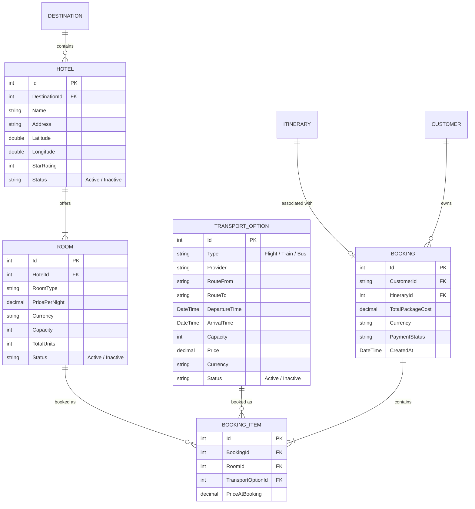

# Student C — Component & Architecture Documentation
## Component C: Accommodation, Transport & Booking Management + AI Booking Agent

> **Course:** SE3090 — Software Engineering Frameworks  
> **Student Ownership:** Student C  
> **Stack:** ASP.NET Core Web API (.NET 8) · PostgreSQL (EF Core) · React (Staff Dashboard) · Flutter (Mobile Customer App) · Python / LangGraph (AI Agent)

---

## 1. Executive Summary & Component Scope

Student C owns **Component C: Accommodation, Transport & Bookings**, which acts as the logistics core of the system. This component manages hotels, rooms, transport options, availability checking, and finally packaging the draft itinerary into a fully priced, concrete booking package.


---

## 2. Progress Summary: Completed vs. Pending Tasks

### 2.1 Overall Status Dashboard

| Subsystem / Layer | Component / Scope | Status | Completion |
|---|---|:---:|:---:|
| **Database & Models** | Tables (`Hotel`, `Room`, `TransportOption`, `Booking`, `BookingItem`) + EF Core | ✅ Completed | 100% |
| **Backend API** | `HotelController`, `TransportController`, `BookingController` + DTOs | ✅ Completed | 100% |
| **Business Logic** | Room Availability Engine, Capacity Checks, Total Package Pricing | ✅ Completed | 100% |
| **Testing Suite** | Backend XUnit tests (`AvailabilityServiceTests.cs`) + Agent validation | ✅ In Progress | 90% |
| **React Staff UI** | Hotel Management, Transport Management | ✅ Completed | 100% |
| **Flutter Mobile UI** | Booking Confirmation, Payment Simulation | ✅ Completed | 100% |
| **Agentic AI** | Python booking agent, availability tools, and LangGraph adapter | ✅ Completed | 100% |
| **Overall Readiness** | **Component C Overall Readiness** | 🟢 **Implementation substantially complete** |

---

## 3. Database Schema & Data Models

Student C owns and maintains 5 relational database tables within PostgreSQL via Entity Framework Core:



### Table Specifications

#### 1. `Hotel` (`backend/Models/Hotel.cs`)
* Accommodations available at specific destinations.
* Fields: `Id`, `DestinationId` (FK), `Name`, `Address`, `Latitude`, `Longitude`, `StarRating`, `Status`.
* Note: Price lives on `Room` as the single source of truth.

#### 2. `Room` (`backend/Models/Room.cs`)
* Specific room types offered by a hotel.
* Fields: `Id`, `HotelId` (FK), `RoomType`, `PricePerNight`, `Currency`, `Capacity` (occupancy), `TotalUnits` (inventory).

#### 3. `TransportOption` (`backend/Models/TransportOption.cs`)
* A single transport option (e.g., one specific flight on a specific date).
* Fields: `Id`, `Type` (Enum: Flight, Train, Bus), `Provider`, `RouteFrom`, `RouteTo`, `DepartureTime`, `ArrivalTime`, `Capacity`, `Price`.

#### 4. `Booking` & `BookingItem` (`backend/Models/Booking.cs`, etc.)
* The confirmed logistical package built from the itinerary.
* Records the total package cost and exact items selected.

---

## 4. Backend Architecture & Business Logic (ASP.NET Core)

### 4.1 Controllers

| Controller | Route | HTTP Method | Authorization | Purpose |
|---|---|---|---|---|
| `HotelController` | `/api/hotel` | `GET` | `[AllowAnonymous]` | List and filter hotels by destination, rating |
| `HotelController` | `/api/hotel` | `POST` | `[Authorize(Roles="TravelAgent,Admin")]` | Create new hotel |
| `TransportController`| `/api/transport` | `GET` | `[AllowAnonymous]` | List transport options by date, route |
| `BookingController` | `/api/booking` | `POST` | `[Authorize]` | Create a booking from an itinerary |

### 4.2 Core Service Business Logic

#### A. Availability Engine (`AvailabilityService.cs`)
To prevent double-booking, the engine checks existing bookings for a room type overlapping the requested dates, ensuring the count doesn't exceed `Room.TotalUnits`.
Similar capacity tracking is applied to `TransportOption.Capacity`.

#### B. Dynamic Package Pricing
When assembling the booking, total cost is computed dynamically:
`TotalCost = Itinerary.TotalEstimatedCost + (Room.PricePerNight * Nights) + (Transport.Price * TravellerCount)`.

---

## 5. AI Agent Design: Booking Agent

> **File:** `agentic-ai/agents/booking_agent.py`  
> **Framework:** Python + LangGraph + Google Gen AI client  

### 5.1 Role in Multi-Agent Pipeline
The Booking Agent is **Agent 3** in the 4-agent sequential workflow:
```
[TripRequest] ──► Coordinator ──► Itinerary Agent ──► Agent 3: Booking Agent ──► Validation Agent
```

### 5.2 Agent Specifications
* **Agent Name:** `BookingAgent`
* **Input Contract:**
  Receives the `trip_request` details and the `itinerary` generated by Agent 2.
* **Tools Owned:**
  * `search_hotels(destination_id)`
  * `search_hotel_rooms(hotel_id)`
  * `check_room_availability(hotel_id, room_id, start_date, end_date)`
  * `search_transports()`
  * `check_transport_availability(transport_id)`
* **Deterministic Rules Enforced by the Agent:**
  1. Only propose rooms where `capacity >= traveller_count` and availability is confirmed.
  2. Only propose transport options where `capacity >= traveller_count` and availability is confirmed.
  3. Pick exactly one valid room and one valid transport.
* **Output Contract:**
  ```json
  {
    "booking_package_id": null,
    "total_package_cost": 50000.0,
    "currency": "LKR",
    "itinerary": { ... },
    "selected_room": {
      "hotel_id": 1,
      "room_id": 1,
      "hotel_name": "Grand Hotel",
      "price_per_night": 150.0
    },
    "selected_transport": {
      "transport_id": 401,
      "type": "Flight",
      "provider": "SkyWings Airlines",
      "price": 200.0
    }
  }
  ```

---

## 6. Viva & Marking Defense Guide for Student C

When defending your component in the viva examination, focus on these key highlights:

1. **How do you handle room inventory and prevent double bookings?**
   - *Answer:* Through the `AvailabilityService`. When queried, we sum all existing active bookings for a specific `RoomId` that overlap the requested dates. If `Active Bookings < TotalUnits`, the room is available.
2. **Why is Transport Option structured as individual dated departures?**
   - *Answer:* As a deliberate architectural decision to simplify inventory tracking. Instead of recurring schedules, each `TransportOption` is a concrete departure instance with its own `Capacity`, matching the requirements of specific dated trip requests.
3. **How does the Booking Agent integrate with the system?**
   - *Answer:* It acts as the bridge between the planned schedule (Student B) and the final financial package (Student D). It calls real backend APIs to find available inventory, injects it into a prompt, and uses an LLM to smartly select the best pairing and calculate the new grand total.
